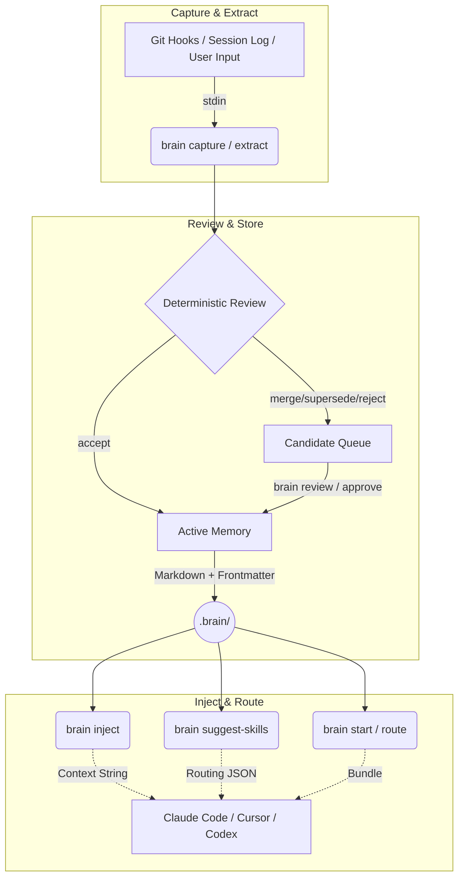
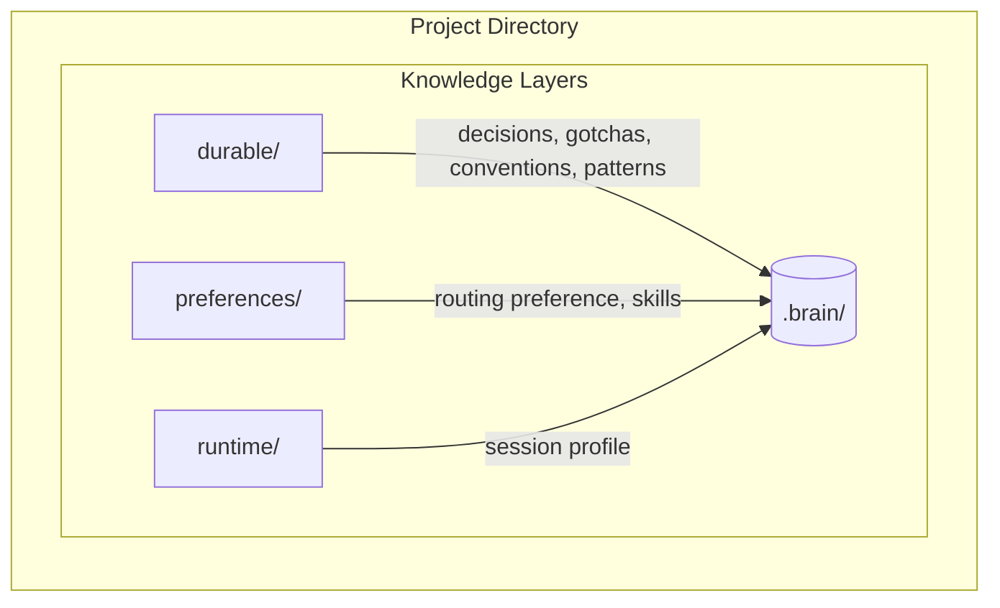

# RepoBrain

**Git-friendly repo memory for coding agents.**

[English](./README.md) | [中文](./README.zh-CN.md)

<p align="center">
  <!-- <a href="https://github.com/XD319/RepoBrain/stargazers"></a>
  <a href="https://github.com/XD319/RepoBrain/forks"></a>
  <a href="https://github.com/XD319/RepoBrain/issues"></a> -->
  <a href="https://github.com/XD319/RepoBrain/blob/main/LICENSE"></a>
  <a href="https://www.npmjs.com/package/repobrain"></a>
</p>

RepoBrain is local, Git-friendly memory infrastructure for coding agents (Claude Code, Codex, Cursor, Copilot). It acts as a durable repository knowledge base, holding onto architecture decisions, gotchas, conventions, and reusable implementation patterns so they persist across sessions.

**Core value:** Stop re-explaining the same repo context to your agent at the start of every new session!

---

## 🚀 Quick Start

**1. Install**
```bash
npm install -g repobrain
```

**2. Setup your repo**
```bash
brain setup
```

**3. TUI Interface (Optional, but recommended for interactive management)**
```bash
brain tui
```

**4. Core Loop Examples (3 Workflow Modes)**

`ultra-safe-manual` (strict manual control)
```bash
# Setup once
brain setup --workflow ultra-safe-manual

# MANUAL: capture via input text
brain capture --task "define API validation boundary" --input "decision: keep API validation at controller boundary"

# MANUAL: start next session with memory context
brain inject
```

`recommended-semi-auto` (default, candidate-first)
```bash
# Setup once
brain setup --workflow recommended-semi-auto

# AUTO: hooks/detect mode can trigger candidate capture opportunities
# MANUAL (optional): explicitly capture this session summary
brain capture --task "fix payment timeout" --input "gotcha: retry loop exits too early when timeout is unset"

# MANUAL: review + approve safe items, then inject
brain review
brain approve --safe
brain inject --task "continue payment timeout fix"
```

`automation-first` (safe auto-promotion enabled)
```bash
# Setup once
brain setup --workflow automation-first

# AUTO: hooks/detect mode can trigger candidate capture opportunities
# MANUAL (optional): explicitly capture this session summary
brain capture --task "stabilize config loader" --input "pattern: normalize env booleans before config branching"

# AUTO: safe candidates can be auto-promoted (when checks pass)
# MANUAL: force an immediate promotion pass now
brain promote-candidates

# MANUAL: start next task with bundled routing context
brain route --task "refactor config loading" --format json
```

---

## 🧩 How It Works (Project Flow Diagram)

Here is a high-level overview of RepoBrain's workflow. It securely extracts, reviews, stores, and then injects repo knowledge back into your coding agents.



---

## 📂 Architecture & Memory Structure

RepoBrain manages memories locally within the `.brain/` directory.



### Knowledge Layers
| Layer | Location | Purpose |
| --- | --- | --- |
| **Durable repo knowledge** | `.brain/{decisions,gotchas,...}/` | Long-term memory logic (decisions, rules) to keep in Git. |
| **Routing preference** | `.brain/preferences/` | Team workflows and rules (prefer/avoid/require skills). |
| **Session profile** | `.brain/runtime/session-profile.json` | Ephemeral hints for *this* session only. Ignored by git. |

---

## 🛠️ Commands Matrix

| Action | Command | Purpose |
| ------ | ------- | ------- |
| **Setup** | `brain setup` | Start a `.brain/` Workspace in repo. |
| **Ingest** | `brain extract`, `brain capture` | Translate stdin or files into `.brain/` Candidate Markdown. |
| **Review** | `brain review`, `brain approve` | View candidate memories and save to Active Store. |
| **Inject** | `brain inject` | Generate the Memory Payload Context block for your agent prompt. |
| **Query** | `brain search`, `brain list` | Find memories across titles, summaries, tags, and status. |
| **Analyze** | `brain audit-memory`, `brain stats` | Lints and maintains schema & structural integrity over time. |

> For extended integrations (MCP, Claude plugin, Cursor directives), please review `/docs` and the `/integrations` directories! Let your agents actually remember.

---

## Layered Inject

`brain inject` now supports optional layered output for progressive retrieval, while keeping the default behavior fully compatible.

```bash
# Default behavior (same as before)
brain inject

# Minimal retrieval index for session start
brain inject --layer index --task "fix refund flow"

# Existing summary-oriented inject payload
brain inject --layer summary --task "fix refund flow"

# Expand specific memories by id into summary/full
brain inject --layer summary --ids "decisions/2026-04-01-refund-boundary-090000000.md"
brain inject --layer full --ids "2026-04-01-refund-boundary-090000000"
```

Layer semantics:

- `index`: compact list with `id`, `title`, `tags`, `score`, `totalScore`, and `why_now` when task-aware reasons exist.
- `summary`: default layer, equivalent to the existing inject markdown experience.
- `full`: includes serialized memory markdown for each selected item, including complete frontmatter and detail.

`--ids` accepts repeated values or a comma-separated list. RepoBrain reuses the existing memory file identifiers, so each id can be either:

- the `.brain/` relative path, such as `decisions/2026-04-01-refund-boundary-090000000.md`
- the file stem, such as `2026-04-01-refund-boundary-090000000`

Without `--ids`, `index` and `summary` still use the normal ranking and token-budget selection flow. `full` is intentionally stricter and requires `--ids` so the CLI does not dump every selected memory body by accident.

Invalid layer values, unknown ids, duplicate ids, or non-injectable memories return clear CLI errors. When no memories are selected, supported layers keep the same CLI-friendly empty-state style.

## Route Expansion Plan

`brain route` / `brain start` now include a lightweight progressive-retrieval hint in the JSON bundle:

```bash
brain route --task "fix refund bug" --format json
```

The bundle may include:

- `expansion_plan.suggested_summary_ids`
- `expansion_plan.suggested_full_ids`

These ids are derived from the same matched memories and routing signals already used for routing. RepoBrain keeps them intentionally small:

- stronger task/path matches are favored for `suggested_summary_ids`
- higher-risk matches are favored for `suggested_full_ids`

Markdown output stays compatible with the current structure and only adds a short `Expansion Plan` section near the end when hints are available.
