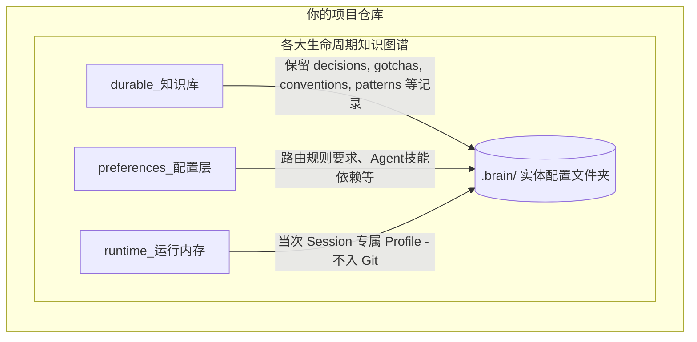

# RepoBrain

**面向 Coding Agent 的 Git-Friendly 仓库记忆库**

[English](./README.md) | [中文](./README.zh-CN.md)

<p align="center">
  <a href="https://github.com/XD319/RepoBrain/stargazers"></a>
  <a href="https://github.com/XD319/RepoBrain/forks"></a>
  <a href="https://github.com/XD319/RepoBrain/issues"></a>
  <a href="https://github.com/XD319/RepoBrain/blob/main/LICENSE"></a>
  <a href="https://www.npmjs.com/package/repobrain"></a>
</p>

RepoBrain 提供了一种本地优先 (local-first)、Git 友好 (git-friendly) 的记忆基础设施，为 Claude Code、Codex、Cursor、Copilot 等 AI Assistant 提供专属化仓库语境。它可以将架构决策、避坑指南、代码规约及最佳实践固化，打破各个独立会话间的记忆孤岛。

**核心价值：**让 Agent 聪明起来，不再每次新会话都需要重新喂同样的上下文信息！

---

## 🚀 Quick Start (快速开始)

**1. 全局安装**
```bash
npm install -g repobrain
```

**2. 初始化项目结构**
```bash
brain setup
```

**3. TUI 可视化交互终端 (推荐)**
```bash
brain tui
```

**4. 核心工作流示例（3 种 Workflow 模式）**

`ultra-safe-manual`（严格人工控制）
```bash
# 一次性初始化
brain setup --workflow ultra-safe-manual

# 手动：通过输入文本触发 capture
brain capture --task "确定 API 校验边界" --input "decision: API 参数校验统一放在 controller 边界层"

# 手动：下次会话注入上下文
brain inject
```

`recommended-semi-auto`（默认，候选优先）
```bash
# 一次性初始化
brain setup --workflow recommended-semi-auto

# 自动：detect 模式下可由 hooks/检测逻辑触发候选采集机会
# 手动（可选）：显式提交本次会话摘要
brain capture --task "修复支付超时问题" --input "gotcha: timeout 未设置时，重试循环会提前退出"

# 手动：审核并快速通过安全项，再注入
brain review
brain approve --safe
brain inject --task "继续修复支付超时问题"
```

`automation-first`（开启安全自动提升）
```bash
# 一次性初始化
brain setup --workflow automation-first

# 自动：detect 模式下可由 hooks/检测逻辑触发候选采集机会
# 手动（可选）：显式提交本次会话摘要
brain capture --task "稳定配置加载流程" --input "pattern: 进入配置分支前先标准化环境变量布尔值"

# 自动：满足严格安全条件时可自动提升候选
# 手动：立即执行一次提升流程
brain promote-candidates

# 手动：下个任务输出一体化路由结果
brain route --task "重构配置加载逻辑" --format json
```

---

## 🧩 How It Works (项目流程图)

以下是 RepoBrain 抽象的数据流闭环。提取总结内容、执行决定性归类审核系统、存储知识以及下次开发前实施智能上下文注入加载。

```mermaid
flowchart TD
    subgraph 提取阶段 (Capture & Extract)
        A[Git Hooks / Session 日志 / 管道输入] -->|stdin| B(brain capture / extract)
    end
    
    subgraph 审核并入库 (Review & Store)
        B --> C{逻辑判定系统 (Review)}
        C -- 合并/丢弃/替换等 --> D[候选队列 CandidateQueue]
        C -- 同意 accept --> E[激活状态 Active Memory]
        D -->|人工介入/规则自动 approve| E
        E -->|生成 Markdown + Frontmatter| F((存入 .brain/ 目录))
    end
    
    subgraph 上下文路由输出 (Inject & Route)
        F --> G(brain inject)
        F --> H(brain suggest-skills)
        F --> I(brain start / route)
        G -.->|上下文纯文本| J[Claude Code / Cursor / Codex]
        H -.->|JSON 路由参数| J
        I -.->|一体化包裹| J
    end
```

---

## 📂 Architecture & Memory Structure (项目架构与结构分布)

所有的记忆文件都会完全透明地沉淀在你的本地 `.brain/` 目录，完全能以 Git 进行追溯与评审。



### 知识分层策略
| 模块层级 | 所属目录 | 核心定位 |
| --- | --- | --- |
| **可审计长期知识层** | `.brain/{decisions,gotchas,patterns,...}/` | 会进入 Git 管理，记录不可更改事实与架构决议。 |
| **偏好指引层** | `.brain/preferences/` | 工具、工作流的偏好以及路由规则 (prefer / avoid)，同样进入 Git。 |
| **会话状态层** | `.brain/runtime/session-profile.json` | 仅在当前会话窗口生效，临时设定，避免脏数据进入代码仓库。 |

---

## 🛠️ 常用 CLI 指令

| 动作流 | 具体命令 | 功能说明 |
| ------ | ------- | ------- |
| **配置** | `brain setup` | 为当前仓库建立 `.brain/` 及 Git Hooks 配置依赖。 |
| **提取** | `brain extract`, `brain capture` | 分析管道流日志及对话，以 Markdown 写入候选记忆库。 |
| **审批** | `brain review`, `brain approve` | 手动/自动审查候选记忆状态并转移为 Active 激活状态。 |
| **注入** | `brain inject` | 在新建代理会话时，导出最高高频重要指令及情景数据。 |
| **查询** | `brain search`, `brain list` | 全局查询相关 Repo 概念细节知识。 |
| **维稳** | `brain audit-memory`, `brain stats` | 定期检查、Schema 健康度清理、执行缓存状态扫描。 |

> 对于包含 MCP, Claude Code 插件集成或者 Cursor 预设，请深度查阅代码库根源下的 `/docs` 以及 `/integrations`。
---

## 分层 Inject

`brain inject` 现在支持可选的分层输出，用来做渐进式 retrieval；默认行为仍与过去保持兼容。

```bash
# 默认行为（与之前一致）
brain inject

# 适合 session start 的最小索引层
brain inject --layer index --task "fix refund flow"

# 现有的摘要型注入体验
brain inject --layer summary --task "fix refund flow"

# 输出完整 memory 内容（frontmatter + detail）
brain inject --layer full --task "fix refund flow"
```

各层语义：

- `index`：紧凑输出 `id`、`title`、`tags`、`score`、`totalScore`，以及存在 task-aware 原因时的 `why_now`。
- `summary`：默认层，等价于当前的 inject Markdown 体验。
- `full`：为每条已选 memory 输出完整序列化 Markdown，包含完整 frontmatter 和 detail。

如果 `--layer` 取值非法，CLI 会返回清晰错误提示；如果某一层没有命中结果，也会保持当前 CLI 一致的空结果风格。
