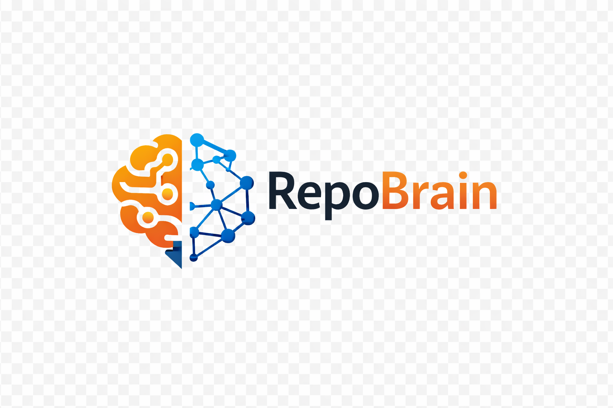

# RepoBrain

<p align="center">
  
</p>

**面向 Coding Agent 的 Git-friendly 仓库记忆层。**

[English](./README.md) | [中文](./README.zh-CN.md)

<p align="center">
  <a href="https://www.npmjs.com/package/repobrain"></a>
  <a href="https://github.com/XD319/RepoBrain/blob/main/package.json">=20" /></a>
  <a href="https://github.com/XD319/RepoBrain/blob/main/LICENSE"></a>
</p>

RepoBrain 是一套面向 Claude Code、Codex、Cursor、Copilot 等 Coding Agent 的本地优先、Git 友好的仓库记忆基础设施。它会把架构决策、踩坑记录、代码约定和可复用模式沉淀为仓库内可审阅的资产，让 Agent 在跨会话工作时延续项目上下文，而不是每次都重新学习一遍。

## 为什么用 RepoBrain

- 把持久化仓库知识保存在 `.brain/` 中，格式是普通 Markdown 加 frontmatter。
- 通过正常的 Git review 流程审阅记忆变化，而不是把上下文锁在黑盒服务里。
- 用 `brain inject`、`brain suggest-skills` 和 `brain route` 在新会话里取回合适的上下文。

## 快速开始

### 前置要求

- Node.js `>=20`
- 一个希望让 Agent 记住上下文的 Git 仓库

### 安装

```bash
npm install -g repobrain
brain --version
```

`brain` 和 `repobrain` 指向同一个 CLI。若你不想全局安装，生成的 steering rules 里也会说明 `npx brain` 和 `node dist/cli.js` 的备用用法。

### 推荐初始化方式

```bash
brain setup
```

`brain setup` 是推荐的上手入口。它会初始化 `.brain/`、应用默认 workflow preset、按需安装匹配的低风险 Git hook，并可为支持的 Agent 工具生成 steering rules。若你只想创建工作区和 steering rules，而不执行 setup 自动化，可以使用 `brain init`。

### 60 秒体验主流程

在默认的 `recommended-semi-auto` 模式下，RepoBrain 会自动接管重复性的采集流程：`brain setup` 可安装匹配的低风险 Git hook，日常 Git 操作中会自动检测可提取机会，新记忆先进入可审阅的 candidate 队列，而不会立刻变成生效记忆。

```bash
# 一次性初始化：创建 .brain/ 并安装默认低风险 hook
brain setup

# 正常开发；默认模式会自动检测可提取机会
git commit -m "refactor request validation"

# 需要时仍可手动补充明确的会话结论
echo "decision: keep API validation at the controller boundary" | brain capture --task "stabilize request validation"

# 审阅“自动检测 + 手动补充”产生的 candidate 队列
brain review
brain approve --safe

# 为下一次任务生成仓库上下文
brain inject --task "continue request validation cleanup"

# 为任务型 Agent 会话生成上下文和路由提示
brain route --task "refactor request validation" --format json
```

默认闭环可以理解为：日常开发时自动检测，先进入 candidate 队列，随后用 `brain approve --safe` 快速处理明显安全的项，再用 `brain approve <id>` 处理边界情况。

可选的交互式终端界面：

```bash
brain tui
```

## 选择 Workflow Preset

RepoBrain 内置了三种 workflow preset，让团队可以在不改变核心 CLI 契约的前提下，选择合适的自动化强度。

| Preset | 适合场景 | 采集方式 | 提升方式 |
| --- | --- | --- | --- |
| `ultra-safe-manual` | 强人工控制仓库 | 仅手动提取 | 仅手动审批 |
| `recommended-semi-auto` | 大多数团队和个人仓库 | 自动检测机会，先存成 candidate | 人工 review，支持快速安全审批 |
| `automation-first` | 评审纪律稳定的成熟仓库 | 自动检测机会，先存成 candidate | 条件满足时自动提升安全 candidate |

示例：

```bash
brain setup --workflow ultra-safe-manual
brain setup --workflow recommended-semi-auto
brain setup --workflow automation-first
```

完整对比请看 [docs/workflow-modes.zh-CN.md](./docs/workflow-modes.zh-CN.md)。

## 它如何落在仓库里

RepoBrain 把记忆保存在当前仓库的本地目录中：

```text
.brain/
  decisions/
  gotchas/
  conventions/
  patterns/
  preferences/
  runtime/session-profile.json
  index.md
```

- `decisions`、`gotchas`、`conventions`、`patterns` 等持久化知识适合进入 Git。
- `.brain/preferences/` 里的偏好用于路由时表达 prefer / avoid 的 skill 或 workflow 选择。
- `.brain/runtime/` 中的数据更偏会话态，可以保持临时性。

## 核心命令

| 目标 | 命令 | 作用 |
| --- | --- | --- |
| 初始化仓库 | `brain setup`, `brain init` | 创建 `.brain/`、应用 workflow preset，并可写入 steering rules |
| 采集知识 | `brain extract`, `brain extract-commit`, `brain capture` | 从 stdin、commit 上下文或会话总结中提取 durable memory |
| 审阅 candidate | `brain review`, `brain approve`, `brain dismiss`, `brain promote-candidates` | 保持 candidate-first 流程可审阅 |
| 启动任务 | `brain inject`, `brain suggest-skills`, `brain route`, `brain start` | 生成上下文块和确定性的路由计划 |
| 检索记忆 | `brain list`, `brain search`, `brain timeline`, `brain explain-memory`, `brain explain-preference` | 查看仓库已经知道什么 |
| 维护质量 | `brain status`, `brain next`, `brain audit-memory`, `brain lint-memory`, `brain normalize-memory`, `brain score`, `brain sweep` | 长期维护记忆质量 |
| 团队与适配器 | `brain share`, `brain mcp`, `brain reinforce`, `brain routing-feedback` | 分享记忆、接入适配器、闭环反馈 |

完整命令参考见 [docs/cli-reference.zh-CN.md](./docs/cli-reference.zh-CN.md)。

## 渐进式检索

RepoBrain 在保持默认 `brain inject` 行为兼容的同时，也支持更适合大型仓库或高安全场景的分层检索。

```bash
brain inject --layer index --task "fix refund flow"
brain inject --layer summary --task "fix refund flow"
brain inject --layer full --ids "2026-04-01-refund-boundary-090000000"
```

- `index` 返回紧凑的检索列表。
- `summary` 保留熟悉的会话起始 Markdown 上下文。
- `full` 用于按需展开指定 memory 正文。

`brain route` 和 `brain start` 也可以在 JSON bundle 里附带轻量的 expansion hints；同时 RepoBrain 还能维护派生缓存 `.brain/memory-index.json`，加速定向查询而不改变 Markdown 作为 source of truth 的事实。

## 文档与 Integrations

顶层 README 适合快速上手，深入资料可以从这里继续：

| 需求 | 跳转 |
| --- | --- |
| 完整 CLI 参考 | [docs/cli-reference.zh-CN.md](./docs/cli-reference.zh-CN.md) |
| Workflow preset 说明 | [docs/workflow-modes.zh-CN.md](./docs/workflow-modes.zh-CN.md) |
| 架构与存储模型 | [docs/architecture.zh-CN.md](./docs/architecture.zh-CN.md) |
| 库/API 用法 | [docs/api.md](./docs/api.md) |
| 团队落地与评估 | [docs/team-workflow.zh-CN.md](./docs/team-workflow.zh-CN.md), [docs/evaluation.zh-CN.md](./docs/evaluation.zh-CN.md) |
| 案例与演示证明 | [docs/case-studies](./docs/case-studies), [docs/demo-proof.zh-CN.md](./docs/demo-proof.zh-CN.md) |
| Extended integrations 总览 | [integrations/README.md](./integrations/README.md) |
| 各 Agent 适配说明 | [integrations/claude/README.md](./integrations/claude/README.md), [integrations/codex/README.md](./integrations/codex/README.md), [integrations/cursor/README.md](./integrations/cursor/README.md), [integrations/copilot/README.md](./integrations/copilot/README.md) |

如需查看 extended integrations、adapter contract 和各 Agent 的接入细节，请继续阅读 `/docs` 与 `/integrations` 目录。
